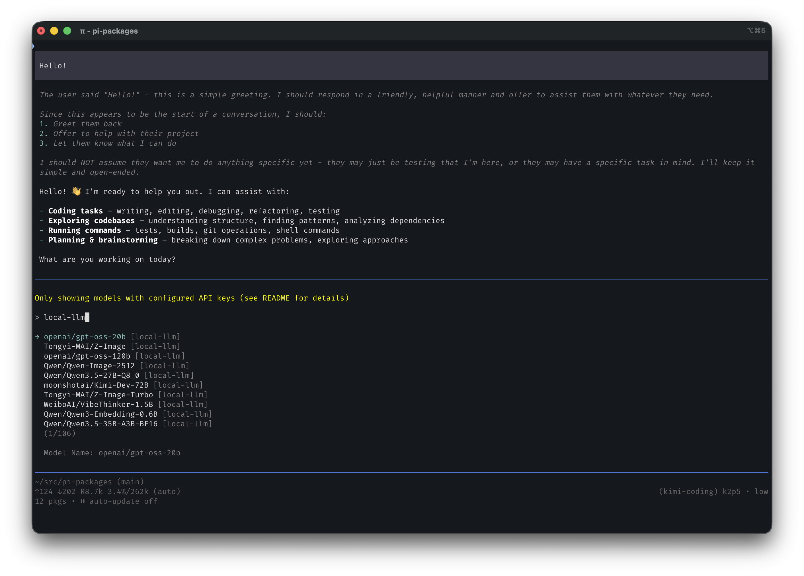

# pi-dynamic-models

```bash
pi install @ssweens/pi-dynamic-models
```

Dynamic model discovery for [pi](https://github.com/badlogic/pi-mono). Point it at any OpenAI-compatible API server or model-catalog endpoint and it fetches available models at startup — no manual model list needed.



## Setup

### 1. Install the package

Add to your Pi agent settings (`~/.pi/agent/settings.json`):

```json
{
  "packages": [
    "local:/path/to/playbook/packages/pi-dynamic-models"
  ]
}
```

### 2. Create the config file

Create `~/.pi/agent/settings/pi-dynamic-models.json`:

```json
[
  {
    "provider": "local-llm",
    "baseUrl": "http://192.168.1.51:9999/v1",
    "apiKey": "MY_API_KEY",
    "api": "openai-completions",
    "compat": {
      "supportsUsageInStreaming": true,
      "maxTokensField": "max_tokens"
    }
  },
  {
    "provider": "clinepass",
    "baseUrl": "https://api.cline.bot/api/v1",
    "apiKey": "$CLINE_API_KEY",
    "api": "openai-completions",
    "modelsSource": {
      "url": "https://api.cline.bot/api/v1/ai/cline/recommended-models",
      "itemsPath": "clinePass",
      "idPath": "id",
      "namePath": "name"
    }
  },
  {
    "provider": "my-proxy",
    "baseUrl": "http://localhost:8082",
    "apiKey": "secret",
    "api": "anthropic-messages"
  }
]
```

### Fields

| Field | Required | Description |
|-------|----------|-------------|
| `provider` | ✓ | Name shown in the model selector |
| `baseUrl` | ✓ | Server URL, including `/v1` if needed |
| `api` | | Pi API type (default: `openai-completions`). See below. |
| `apiKey` | | Literal key, env var name, `$ENV_VAR`, or `!shell-command`. Omit for open servers. |
| `compat` | | OpenAI compat overrides applied to every chat model. See below. |
| `imageApi` | | Image-generation API implementation. Set to `openrouter-images` only when the endpoint accepts OpenRouter's chat-completions image format. OpenRouter URLs enable it automatically. |
| `modelsSource` | | Optional model catalog endpoint + JSON paths (`url`, `itemsPath`, `idPath`, `namePath`). Defaults to GET `{baseUrl}/models` and `data` when omitted; architecture metadata is read from each model's `architecture` object. |
| `models` | | Per-model metadata keyed by model ID. Overrides defaults for discovered models. Models listed here but not returned by the server are still registered. |

#### `models` override fields (all optional)

| Field | Type | Default |
|-------|------|---------|
| `name` | string | model ID |
| `reasoning` | boolean | `false` |
| `input` | `["text"]` \| `["text","image"]` | `["text"]` |
| `contextWindow` | number | `128000` |
| `maxTokens` | number | `16384` |
| `architecture.input_modalities` | string[] | From catalog metadata; supported values map to Pi's `input` field. |
| `architecture.output_modalities` | string[] | From catalog metadata; selects chat, image, and classifier registrations. |
| `imageApi` | `"openrouter-images"` | Inherits the provider setting; otherwise the image operation is not registered. |

If the server is unreachable at startup, only models explicitly listed in `models` are registered.

### OpenRouter modality metadata

The extension reads `architecture.input_modalities` and
`architecture.output_modalities` from OpenRouter-style model records. A normal
text catalog without `architecture` keeps the legacy chat behavior. Explicit
outputs map to Pi operations: `text` → chat, `image` → image, and
`decisions` → classifier through Pi's TypeSafe System One handler. One model
may register multiple operations under the same ID.

For a direct `openrouter.ai` base URL, discovery fetches the normal model list
plus `output_modalities=image` and `output_modalities=decisions`; those
operation-only models are absent from the default listing. A custom
`modelsSource` is used as-is, so include the architecture fields or query
`output_modalities=all` there.

Pi has no audio, embedding, rerank, transcription, or video model operation.
Those outputs are not registered as chat. Non-OpenRouter image endpoints must
set `imageApi: "openrouter-images"` only if they accept OpenRouter's
`/chat/completions` image request format; otherwise the image model is omitted
and the startup widget says why. Unsupported input modalities are likewise not
advertised as Pi text/image inputs.

### Supported API types

Any Pi `KnownApi` value:

| Value | Use for |
|-------|---------|
| `openai-completions` | Ollama, vLLM, LM Studio, llama.cpp, most local servers |
| `openai-responses` | OpenAI Responses API compatible servers |
| `anthropic-messages` | Anthropic-compatible proxies |
| `google-generative-ai` | Google AI compatible servers |
| `azure-openai-responses` | Azure OpenAI |

### `compat` fields (openai-completions only)

| Field | Type | Description |
|-------|------|-------------|
| `supportsStore` | boolean | Whether the server supports the `store` field |
| `supportsDeveloperRole` | boolean | Whether to use `developer` role instead of `system` |
| `supportsReasoningEffort` | boolean | Whether the server supports `reasoning_effort` |
| `supportsUsageInStreaming` | boolean | Whether `stream_options: {include_usage: true}` works |
| `maxTokensField` | `"max_tokens"` \| `"max_completion_tokens"` | Which field to use for max output tokens |
| `requiresToolResultName` | boolean | Whether tool results require the `name` field |
| `requiresAssistantAfterToolResult` | boolean | Whether an assistant message is required between tool result and next user message |
| `requiresThinkingAsText` | boolean | Whether thinking blocks must be converted to `<thinking>` text |
| `requiresMistralToolIds` | boolean | Whether tool call IDs must be normalized to Mistral format |
| `thinkingFormat` | `"openai"` \| `"zai"` \| `"qwen"` | Format for reasoning/thinking parameter |
| `supportsStrictMode` | boolean | Whether the `strict` field in tool definitions is supported |

## Overriding model metadata

Discovered models use conservative defaults (`contextWindow: 128000`, `maxTokens: 16384`, `reasoning: false`, `input: ["text"]`). Override them directly in the config file using the `models` dict. Use the same snake-case `architecture` keys as OpenRouter:

```json
{
  "provider": "local-llm",
  "baseUrl": "http://192.168.1.51:9999/v1",
  "models": {
    "my-model-id": {
      "name": "My Model",
      "reasoning": true,
      "input": ["text", "image"],
      "contextWindow": 200000,
      "maxTokens": 32000
    }
  }
}
```

For a catalog that does not expose modality metadata, an explicit classifier
override can use the same OpenRouter field names:

```json
{
  "models": {
    "jev-model": {
      "architecture": {
        "input_modalities": ["text"],
        "output_modalities": ["decisions"]
      }
    }
  }
}
```

## Troubleshooting

**No models appear**: Check that the config file exists at `~/.pi/agent/settings/pi-dynamic-models.json` and the server is reachable.

**Wrong API behavior**: Set the correct `api` field for your server type.

**API key not resolving**: `apiKey` is resolved before the provider is registered. Raw env var names like `CLINE_API_KEY` work, and `$CLINE_API_KEY` / `${CLINE_API_KEY}` are also supported.

**Custom catalog not loading**: Set `modelsSource.url` to the catalog endpoint and `modelsSource.itemsPath` to the array field (for ClinePass, `clinePass`).

**Token counting or field errors**: Add the appropriate `compat` settings for your server.

**`contextWindow` stays at 128000**: `pi-dynamic-models` uses corral's `/corral/models` `context_size` when available. If your server reports `context_size: null` for a model, the extension falls back to `128000` unless you set `models.<id>.contextWindow` explicitly.
